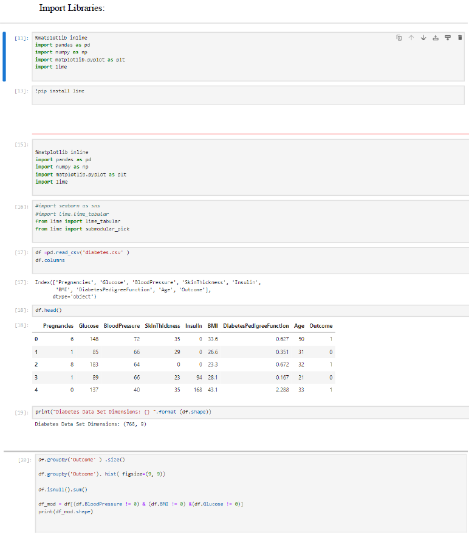
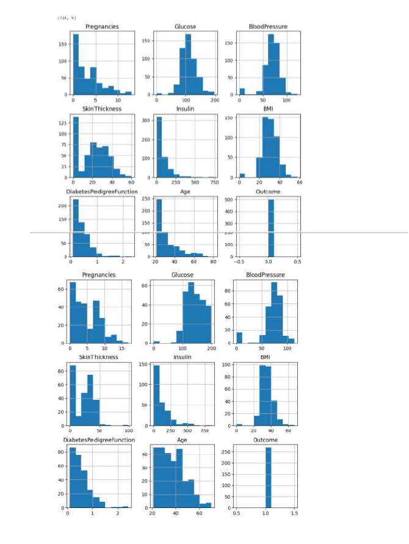
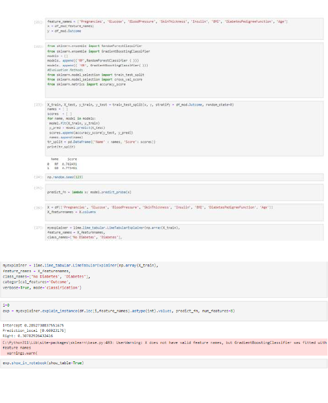
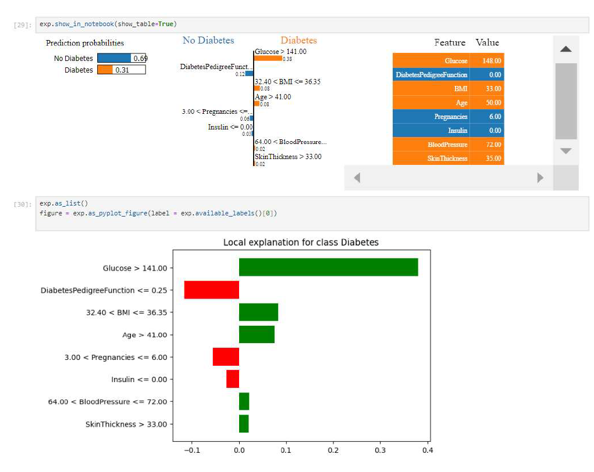

# Healthcare AI model using XAI

## Overview
The project involves building a Python application that interprets the predictions made by a healthcare AI model. The primary focus is on using Explainable AI (XAI) techniques to make the model's decisions transparent and understandable for clinicians. The ultimate goal is to evaluate the effectiveness of these interpretations in supporting clinical decision-making.

## Table of Contents
1. Problem Statement
2. Introduction
3. Algorithm
4. Methodology
5. Code
6. Output
7. Conclusion

## 1. Problem Statement
Build a Python application to interpret the predictions of a healthcare AImodel using XAI techniques and evaluate its effectiveness in clinicaldecision-making.

## 2. Introduction
In the realm of healthcare, AI models are increasingly being used to supportclinical decision-making by providing predictive insights based on patient data. This project aims to build a Python application that interprets the predictions of ahealthcare AI model using Explainable AI (XAI) techniques, specifically focusing on predicting diabetes. The effectiveness of these models is evaluated interms of their interpretability and accuracy, crucial factors in clinical settingswhere understanding the rationale behind predictions can significantly impactpatient care.

## 3. Algorithm
Random Forest Algorithm
Gradient Boosting Algorithm

## 4. Methodology
The project follows a structured methodology to build, evaluate, and interpret the AI model

## 5. Code

## 6. Output

## 7. Conclusion
The project successfully demonstrates the application of Random Forest and Gradient Boosting algorithms to predict diabetes and uses LIME to provide interpretability to these predictions. The visualizations generated by LIME show the contribution of each feature towards the model's prediction, making it easier for healthcare professionals to understand and trust the AI system's decisions. The histograms grouped by 'Outcome' visually differentiate the distributions of features for diabetic and non-diabetic patients, providing insights into the data. This interpretability is crucial for effective clinical decision-making, ensuring that AI-driven predictions are transparent and actionable.
